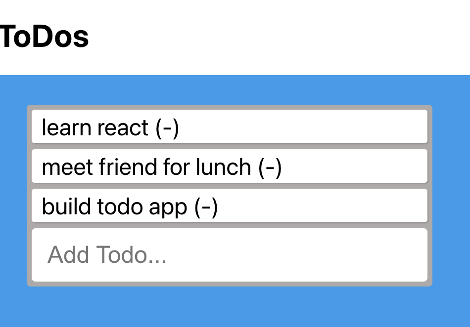

<div align="center" id="top"> 
  

&#xa0;

  <!-- <a href="https://JBD.netlify.app">Demo</a> -->
</div>

<h1 align="center">ToDos</h1>
<div align="center">
  
</div>

<p align="center">
  <a href="#dart-about">About</a> &#xa0; | &#xa0; 
  <a href="#sparkles-features">Features</a> &#xa0; | &#xa0;
  <a href="#rocket-technologies">Technologies</a> &#xa0; | &#xa0;
  <a href="#construction_worker-Roadmap">Roadmap</a> &#xa0; | &#xa0;
  <a href="#white_check_mark-requirements">Requirements</a> &#xa0; | &#xa0;
  <a href="#checkered_flag-starting">Starting</a> &#xa0; | &#xa0;
  <a href="#memo-license">License</a> &#xa0; | &#xa0;
  <a href="https://github.com/JBD84" target="_blank">Author.</a>
</p>

<br>

## :dart: About

This is a ToDOs list project with React. 

## :sparkles: Features

:heavy_check_mark: Information
:heavy_check_mark: Videos and Proyects
:heavy_check_mark: The best way to Contact

## :rocket: Technologies

The following tools were used in this project:

- Node
- React


## :construction_worker: Roadmap

<ul>
<li>Check out the ways to get started.
<li>Browse inside ToDos List 
<li>Enjoy the experience
</ul>

## :white_check_mark: Requirements

Before starting :checkered_flag:, you need to have [Git](https://git-scm.com) and [Node] (https://nodejs.org/en/download/) installed.

## :checkered_flag: Starting

```bash

# Clone this project
$ git clone https://github.com/JBD84/ToDos


```

## :memo: License

This project is under license from MIT. For more details, see the [LICENSE](LICENSE.md) file.

Made by: Heart & Pasion <a href="https://github.com/JBD84" target="_blank">Javier Bambaren D.</a>

&#xa0;

<a href="#top">Back to top</a>
